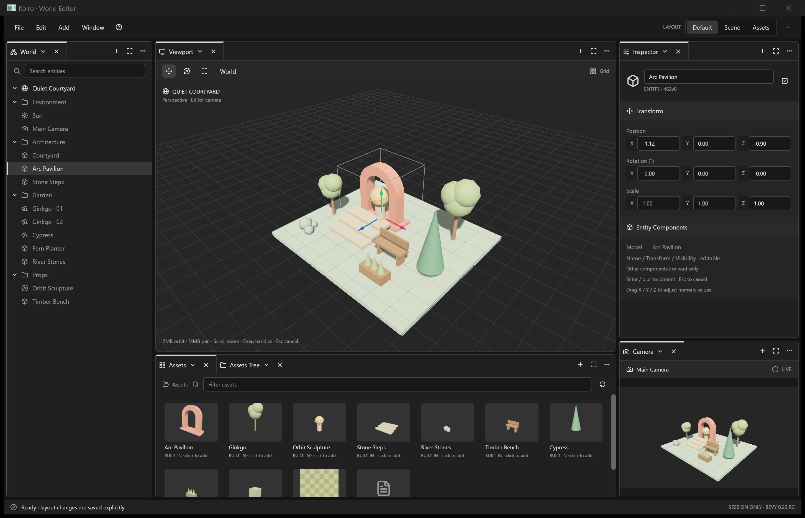

<div align="center">

# Bevy Editor Prototype

</div>

<div align="center">

[English](../README.md) | [简体中文](zh-CN.md) | 日本語 | [Français](fr-FR.md)

</div>

Bevy **0.20.0-rc.2**、BSN、ネイティブ UI コントロールで構築した実験的なデスクトップワールドエディターです。egui や WebView は使用していません。

このプロトタイプは、Bevy UI を使って操作、レイアウト、スタイル、ゲームエンジンのエディター設計を試すためのものです。実用的なエディターとして保守する予定はありません。

<p align="center">
  
</p>

## クイックスタート

### インストール

Rust **1.96+** でソースから実行します。クローンとビルドの手順は[ソースからビルド](#ソースからビルド)を参照してください。プロジェクトのルートで実行します。

```sh
cargo run
```

### 更新

ローカルの変更をコミットまたは stash してから、クローンしたリポジトリで実行します。

```sh
git pull --ff-only
cargo run
```

## 機能

- ドッキング可能なペイン、レイアウトプリセット、同じワールドを共有する複数ウィンドウ。
- ワールドの階層表示、名前と Transform の編集、移動・回転・拡縮の gizmo。
- アセットブラウザー、組み込みモデル、画像プレビュー、リアルタイムのカメラプレビュー。

## 操作と制限

ビューポートでは、右ドラッグで周回、中ドラッグでパン、スクロールでズームします。オブジェクトをクリックして選択し、gizmo のハンドルをドラッグして Transform を編集します。Inspector の入力欄は Enter またはフォーカスが外れたときに確定し、Escape で編集を取り消します。

**Ctrl+S で保存されるのはレイアウトのみ**で、保存先は `editor-layout.json` です。シーンの変更は現在のセッション内でのみ有効です。シーン保存、元に戻す／やり直し、プレイモード、汎用的なコンポーネント編集は未実装です。

## ソースからビルド

Git と Cargo を含む Rust **1.96+** が必要です。Bevy は **0.20.0-rc.2** に固定されています。

```sh
git clone https://github.com/gloridifice/bevy-koiro-editor.git
cd bevy-koiro-editor
cargo build --release --locked
```

エディターが `assets/` を見つけられるよう、プロジェクトのルートで `cargo run --release` を実行してください。

## ライセンス

プロジェクト全体のライセンスは明記されていません。同梱の Lucide アイコンには[上流のライセンス](../src/lucide_icons/LICENSE)が適用されます。

## 開発

- [アーキテクチャ](../doco/architecture.md)
- [エディターの仕様と制限](../doco/specs/editor.md)
- [保守と検証のガイド](../AGENTS.md)
- [BSN UI のサンプル](../examples/bsn_ui.rs)
